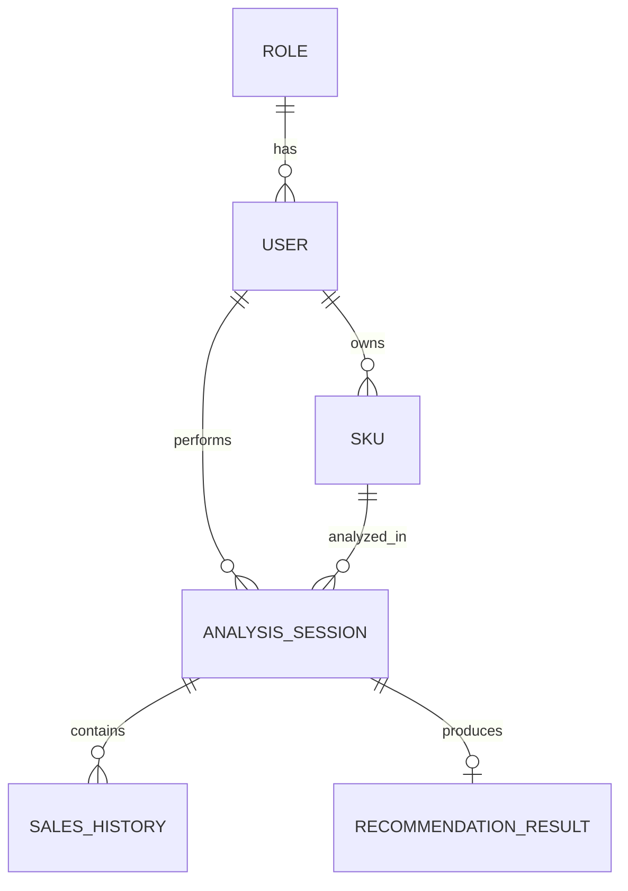

# Entity Identification — Cakra Predictive Replenishment

## 1. Overview

Dokumen ini merangkum hasil identifikasi entity untuk project **Cakra — Predictive Replenishment** berdasarkan PRD dan SRS MVP.

Perlu dibedakan dua kategori entity:

1. **Core MVP Entity** — entity yang secara langsung dibutuhkan oleh alur utama analisis replenishment.
2. **Future-Ready Supporting Entity** — entity yang disiapkan untuk pengembangan berikutnya, tetapi tidak wajib di-expose sebagai fitur pada MVP kompetisi.

> Catatan: PRD dan SRS menyatakan bahwa autentikasi, manajemen akun, dan riwayat lintas sesi berada di luar scope MVP. Namun `Role`, `User`, dan pemisahan `SKU` tetap dapat dipersiapkan pada level database selama tidak menambah kompleksitas pada UI/flow MVP.

---

# 2. Entity List

Entity yang direkomendasikan:

1. `roles`
2. `users`
3. `skus`
4. `analysis_sessions`
5. `sales_histories`
6. `recommendation_results`

Semua primary key menggunakan **UUID**.

---

# 3. Entity Detail

## 3.1 Role

### Purpose

Menyimpan role atau jenis akses pengguna.

Untuk MVP, role dapat dibuat sederhana, misalnya:

- `owner`
- `admin`

### Attributes

| Attribute | Data Type | Constraint | Description |
|---|---|---|---|
| `id` | UUID | PK | Identifier unik role |
| `name` | VARCHAR(50) | UNIQUE, NOT NULL | Nama role |
| `description` | TEXT | NULL | Deskripsi role |
| `created_at` | TIMESTAMP | NOT NULL | Waktu entity dibuat |
| `updated_at` | TIMESTAMP | NOT NULL | Waktu terakhir diperbarui |

### Relation

```text
Role 1 ---- N User
```

Foreign key:

```text
users.role_id -> roles.id
```

---

## 3.2 User

### Purpose

Menyimpan data pengguna sistem.

Entity ini bersifat **future-ready**, karena autentikasi dan manajemen akun tidak diwajibkan pada MVP kompetisi.

### Attributes

| Attribute | Data Type | Constraint | Description |
|---|---|---|---|
| `id` | UUID | PK | Identifier unik user |
| `role_id` | UUID | FK, NOT NULL | Role pengguna |
| `name` | VARCHAR(255) | NOT NULL | Nama pengguna |
| `email` | VARCHAR(255) | UNIQUE, NOT NULL | Email pengguna |
| `password_hash` | TEXT | NOT NULL | Password yang telah di-hash |
| `created_at` | TIMESTAMP | NOT NULL | Waktu user dibuat |
| `updated_at` | TIMESTAMP | NOT NULL | Waktu terakhir diperbarui |

### Relation

```text
Role 1 ---- N User

User 1 ---- N SKU

User 1 ---- N AnalysisSession
```

---

## 3.3 SKU

### Purpose

Merepresentasikan item atau produk yang dianalisis.

Walaupun SRS awal menyimpan `sku_name` langsung pada `analysis_session`, pemisahan SKU menjadi entity sendiri membuat domain model lebih bersih dan lebih mudah dikembangkan.

### Attributes

| Attribute | Data Type | Constraint | Description |
|---|---|---|---|
| `id` | UUID | PK | Identifier unik SKU |
| `user_id` | UUID | FK, NULL | Pemilik SKU |
| `code` | VARCHAR(100) | NULL | Kode SKU |
| `name` | VARCHAR(255) | NOT NULL | Nama SKU |
| `created_at` | TIMESTAMP | NOT NULL | Waktu SKU dibuat |
| `updated_at` | TIMESTAMP | NOT NULL | Waktu terakhir diperbarui |

### Notes

`current_stock` tidak disimpan pada entity SKU karena nilai stok merupakan kondisi pada saat analisis dilakukan.

Contoh:

```text
21 Aug 2026 -> current_stock = 30
25 Aug 2026 -> current_stock = 17
```

Karena itu, `current_stock` disimpan pada `analysis_sessions`.

### Relation

```text
User 1 ---- N SKU

SKU 1 ---- N AnalysisSession
```

---

## 3.4 AnalysisSession

### Purpose

Merepresentasikan satu kali proses analisis terhadap satu SKU.

Entity ini menjadi pusat dari alur analisis:

```text
Input
  ↓
AnalysisSession
  ↓
Demand Classification
  ↓
Forecasting
  ↓
Recommendation
```

### Attributes

| Attribute | Data Type | Constraint | Description |
|---|---|---|---|
| `id` | UUID | PK | Identifier unik sesi analisis |
| `user_id` | UUID | FK, NULL | User yang menjalankan analisis |
| `sku_id` | UUID | FK, NOT NULL | SKU yang dianalisis |
| `current_stock` | INTEGER | NOT NULL | Kondisi stok saat analisis |
| `demand_category` | VARCHAR(20) | NULL | Kategori demand hasil SBC |
| `adi_value` | DECIMAL | NULL | Nilai Average Demand Interval |
| `cv_squared_value` | DECIMAL | NULL | Nilai CV² |
| `status` | VARCHAR(30) | NOT NULL | Status proses analisis |
| `created_at` | TIMESTAMP | NOT NULL | Waktu analisis dibuat |
| `updated_at` | TIMESTAMP | NOT NULL | Waktu terakhir diperbarui |

### Demand Category

Nilai yang memungkinkan:

```text
SMOOTH
ERRATIC
INTERMITTENT
LUMPY
```

### Analysis Status

Nilai yang direkomendasikan:

```text
PROCESSING
SUCCESS
INSUFFICIENT_DATA
FAILED
```

Walaupun proses MVP berjalan synchronous, `status` tetap berguna untuk merepresentasikan hasil analisis secara eksplisit.

### Relation

```text
User 1 ---- N AnalysisSession

SKU 1 ---- N AnalysisSession

AnalysisSession 1 ---- N SalesHistory

AnalysisSession 1 ---- 0..1 RecommendationResult
```

---

## 3.5 SalesHistory

### Purpose

Menyimpan historical sales yang digunakan sebagai input analisis.

Satu analysis session dapat memiliki banyak baris data historis.

### Attributes

| Attribute | Data Type | Constraint | Description |
|---|---|---|---|
| `id` | UUID | PK | Identifier unik histori |
| `analysis_session_id` | UUID | FK, NOT NULL | Analysis session terkait |
| `sale_date` | DATE | NOT NULL | Tanggal penjualan |
| `quantity_sold` | INTEGER | NOT NULL | Jumlah unit yang terjual |
| `unit_price` | DECIMAL(15,2) | NULL | Harga satuan opsional |
| `created_at` | TIMESTAMP | NOT NULL | Waktu data dibuat |

### Constraint

Tidak boleh ada tanggal duplikat dalam satu sesi analisis.

Recommended unique constraint:

```text
UNIQUE (analysis_session_id, sale_date)
```

### Notes

`unit_price` bersifat optional karena tidak digunakan langsung dalam algoritma forecasting dan replenishment MVP.

Jika ingin benar-benar lean, attribute ini dapat dihilangkan.

### Relation

```text
AnalysisSession 1 ---- N SalesHistory
```

---

## 3.6 RecommendationResult

### Purpose

Menyimpan output akhir dari proses analisis replenishment.

Output utama sistem mencakup:

- reorder point,
- reorder quantity,
- forecast,
- risk label,
- alasan risiko,
- explanation.

### Attributes

| Attribute | Data Type | Constraint | Description |
|---|---|---|---|
| `id` | UUID | PK | Identifier unik hasil rekomendasi |
| `analysis_session_id` | UUID | FK, UNIQUE, NOT NULL | Analysis session terkait |
| `reorder_point` | INTEGER | NOT NULL | Reorder Point |
| `reorder_quantity` | INTEGER | NOT NULL | Reorder Quantity |
| `risk_label` | VARCHAR(30) | NOT NULL | Label risiko SKU |
| `risk_reason` | TEXT | NOT NULL | Alasan penentuan risiko |
| `explanation_text` | TEXT | NOT NULL | Narasi explainability |
| `forecast_p50` | JSONB | NOT NULL | Forecast P50 untuk horizon 14 hari |
| `forecast_p90` | JSONB | NOT NULL | Forecast P90 untuk horizon 14 hari |
| `lead_time_days` | INTEGER | NOT NULL | Lead time yang digunakan |
| `service_level` | DECIMAL(5,4) | NOT NULL | Target service level |
| `review_period_days` | INTEGER | NOT NULL | Review period |
| `created_at` | TIMESTAMP | NOT NULL | Waktu hasil dibuat |

### Risk Label

Nilai yang memungkinkan:

```text
STOCKOUT_IMMINENT
NORMAL
DEADSTOCK_CANDIDATE
```

### Default MVP Parameters

```text
lead_time_days = 3
service_level = 0.95
review_period_days = 7
```

Parameter tetap disimpan pada hasil rekomendasi agar rekomendasi dapat direproduksi atau diaudit di kemudian hari.

### Relation

```text
AnalysisSession 1 ---- 0..1 RecommendationResult
```

Relasi dibuat `1 : 0..1`, bukan selalu `1 : 1`.

Hal ini karena analysis session dapat gagal menghasilkan rekomendasi apabila data historis tidak mencukupi.

Contoh:

```text
analysis_session        = exists
sales_history           = exists
recommendation_result   = not exists

status = INSUFFICIENT_DATA
```

---

# 4. Entity Relationship Summary

| Entity A | Cardinality | Entity B | Description |
|---|---|---|---|
| `Role` | 1 : N | `User` | Satu role dapat dimiliki banyak user |
| `User` | 1 : N | `SKU` | Satu user dapat memiliki banyak SKU |
| `User` | 1 : N | `AnalysisSession` | Satu user dapat melakukan banyak analisis |
| `SKU` | 1 : N | `AnalysisSession` | Satu SKU dapat dianalisis berkali-kali |
| `AnalysisSession` | 1 : N | `SalesHistory` | Satu analisis menggunakan banyak data historis |
| `AnalysisSession` | 1 : 0..1 | `RecommendationResult` | Analisis dapat menghasilkan maksimal satu rekomendasi |

---

# 5. ERD Overview

```text
Role
 │
 │ 1
 │
 └──────── N User
              │
              ├──────── 1:N SKU
              │             │
              │             └──────── 1:N AnalysisSession
              │
              └────────────────────── 1:N AnalysisSession
                                           │
                                           ├──────── 1:N SalesHistory
                                           │
                                           └──────── 1:0..1 RecommendationResult
```

Alternative visualization:



---

# 6. Foreign Key Mapping

```text
users.role_id
    -> roles.id

skus.user_id
    -> users.id

analysis_sessions.user_id
    -> users.id

analysis_sessions.sku_id
    -> skus.id

sales_histories.analysis_session_id
    -> analysis_sessions.id

recommendation_results.analysis_session_id
    -> analysis_sessions.id
```

---

# 7. UUID Strategy

Seluruh primary key menggunakan UUID:

```text
roles.id
users.id
skus.id
analysis_sessions.id
sales_histories.id
recommendation_results.id
```

Recommended PostgreSQL type:

```sql
UUID
```

Contoh default generator:

```sql
gen_random_uuid()
```

---

# 8. Entity Not Included in MVP

Beberapa entity sengaja tidak dibuat pada tahap MVP.

## 8.1 Supplier

Supplier belum dibuat karena MVP menggunakan parameter statis:

```text
Lead Time = 3 hari
Service Level = 95%
```

Future development dapat memperkenalkan:

```text
Supplier
SKU Supplier
Supplier Lead Time
```

Contoh relasi masa depan:

```text
Supplier
   1
   │
   N
SKU Supplier
   N
   │
   1
SKU
```

---

## 8.2 Forecast

Forecast tidak dibuat sebagai entity sendiri.

Untuk MVP:

```text
forecast_p50 -> JSONB
forecast_p90 -> JSONB
```

disimpan pada `recommendation_results`.

Karena horizon hanya 14 hari, membuat entity seperti:

```text
forecast
forecast_point
```

akan menambah kompleksitas tanpa manfaat signifikan pada MVP.

---

## 8.3 Demand Model

Model seperti:

```text
Prophet
LightGBM
Croston
TSB
```

tidak perlu menjadi entity database.

Model merupakan bagian dari application/ML layer, bukan domain data yang harus disimpan sebagai tabel pada MVP.

Jika kelak dibutuhkan model versioning, entity seperti `model_versions` dapat diperkenalkan.

---

# 9. MVP Entity Classification

## Core MVP

Entity yang paling dekat dengan requirement utama PRD/SRS:

```text
AnalysisSession
SalesHistory
RecommendationResult
```

## Recommended Domain Entity

Entity tambahan untuk memperjelas domain:

```text
SKU
```

## Future-Ready Supporting Entity

Entity yang disiapkan untuk fitur akun di masa depan:

```text
Role
User
```

---

# 10. Final Recommended Structure

Struktur entity final yang direkomendasikan:

```text
1. Role
2. User
3. SKU
4. AnalysisSession
5. SalesHistory
6. RecommendationResult
```

Dengan relational model:

```text
Role
 └── 1:N User
          │
          ├── 1:N SKU
          │        │
          │        └── 1:N AnalysisSession
          │
          └────────── 1:N AnalysisSession
                            │
                            ├── 1:N SalesHistory
                            │
                            └── 1:0..1 RecommendationResult
```

Semua entity menggunakan UUID sebagai primary key.

---

# 11. Implementation Notes

Untuk implementasi backend, beberapa keputusan database yang disarankan:

- Gunakan UUID untuk seluruh PK dan FK.
- Tambahkan index pada seluruh foreign key.
- Tambahkan unique index pada `users.email`.
- Tambahkan unique constraint pada `(analysis_session_id, sale_date)`.
- Tambahkan unique constraint pada `recommendation_results.analysis_session_id`.
- Gunakan database enum atau application-level enum untuk:
  - `demand_category`
  - `analysis_status`
  - `risk_label`
- Gunakan `JSONB` untuk forecast P50 dan P90 pada MVP.
- Pertimbangkan `ON DELETE CASCADE` dari `analysis_sessions` ke:
  - `sales_histories`
  - `recommendation_results`

Untuk `User`, `SKU`, dan `AnalysisSession`, strategi delete sebaiknya ditentukan kembali berdasarkan kebutuhan audit dan history saat aplikasi berkembang setelah MVP.
