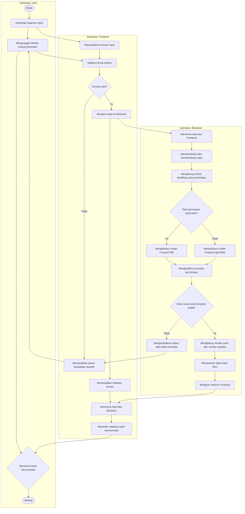
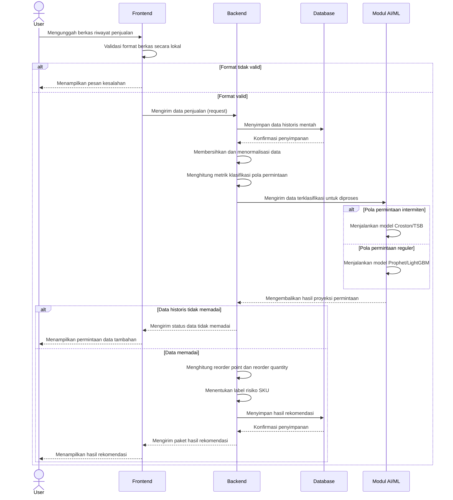

# Product Requirements Document (PRD)

## Cakra — Predictive Replenishment

| Field | Detail |
|---|---|
| **Nama Produk** | Cakra — Predictive Replenishment |
| **Versi Dokumen** | 1.0 (Draft MVP — Babak Penyisihan) |
| **Status** | Draft untuk Review Tim |
| **Kompetisi** | COMPFEST 18 — AI Innovation Challenge (AIC) |
| **Tema Lomba** | AI for the Backbone of the Economy |
| **Domain** | Smart Commerce + Smart Logistics |
| **Tanggal Dibuat** | 21 Agustus 2026 |
| **Tipe PRD** | Standard PRD (cross-functional: Product, AI/ML, Engineering, Design) |
| **Sumber** | Konsep, Arsitektur, dan Interaksi Sistem — Solusi Terpilih: Mesin Rekomendasi Replenishment Prediktif |

---

## 1. Problem Statement

### 1.1 Latar Belakang Masalah

Toko kelontong dan minimarket independen adalah tulang punggung ritel Indonesia — sekitar 3,94 juta unit atau 98,78% dari seluruh gerai ritel nasional (Euromonitor, dikutip Kemendag). Namun mayoritas pelaku usaha ini mengambil keputusan pemesanan ulang barang (replenishment) secara reaktif: memesan setelah stok terlihat menipis atau habis, bukan berdasarkan proyeksi permintaan ke depan.

Studi Gruen & Corsten (Grocery Manufacturers of America) menemukan rata-rata tingkat stockout global sebesar 8,3%, merugikan retailer sekitar 4% dari penjualan tahunan — dan 72% dari kejadian ini disebabkan oleh praktik pemesanan yang keliru di internal toko itu sendiri, bukan gangguan pasokan dari hulu. Di sisi lain, overstock pada barang yang bergerak lambat mengunci modal kerja (carrying cost 20–30% dari nilai persediaan) dan berisiko menjadi stok mati.

### 1.2 Mengapa Masalah Ini Belum Terselesaikan

Root cause analysis (5 Whys, tiga pilar) yang telah dilakukan pada tahap sebelumnya mengidentifikasi:

1. **Pilar Sistem/Teknologi:** Vendor POS SMB Indonesia (Moka, Majoo, Olsera, iREAP, Pawoon, Kasir Pintar) hanya menyediakan notifikasi ambang batas stok statis (rule-based alert), bukan forecasting prediktif — karena mayoritas SKU ritel kecil memiliki pola permintaan intermittent yang menuntut metode khusus (Croston/TSB) di luar kapabilitas forecasting konvensional yang lebih murah diimplementasikan.
2. **Pilar Proses/Bisnis:** Terdapat kekosongan kategori produk antara sistem pencatatan sederhana (POS) dan sistem perencanaan permintaan kelas enterprise (ERP, mis. HashMicro, Netstock) yang mahal dan hanya relevan untuk skala besar.
3. **Pilar Manusia/Perilaku:** Pemilik usaha tidak memiliki waktu maupun keahlian statistik untuk menerjemahkan data penjualan menjadi keputusan restock yang optimal, dan kerugian akibat keputusan intuitif ini tidak pernah terkuantifikasi secara eksplisit sehingga tidak dianggap prioritas.

### 1.3 Pernyataan Masalah (Problem Statement)

> Pelaku usaha retail/grosir kecil-menengah di Indonesia tidak memiliki alat yang mengubah data penjualan historis yang sudah mereka miliki menjadi keputusan replenishment yang proaktif dan actionable — sehingga mereka kehilangan penjualan akibat stockout dan mengunci modal kerja akibat overstock, tanpa pernah menyadari pola yang mendasarinya.

---

## 2. Goals & Success Metrics

### 2.1 Tujuan Produk (SMART Objective)

Mengembangkan mesin rekomendasi berbasis AI yang menghasilkan proyeksi permintaan dan rekomendasi keputusan replenishment (reorder point dan reorder quantity) per SKU bagi pelaku retail/grosir kecil-menengah, dengan penanganan khusus terhadap pola permintaan intermittent, tervalidasi pada minimal satu dataset uji representatif dalam periode pengembangan babak penyisihan.

### 2.2 Success Metrics (untuk Tahap MVP/Penyisihan)

| Metrik | Target | Cara Ukur |
|---|---|---|
| Akurasi peramalan (regular demand) | Dievaluasi dengan metrik yang sesuai (mis. MAPE/RMSE pada data uji) | Backtesting pada data historis yang di-hold-out |
| Akurasi peramalan (intermittent demand) | Dievaluasi dengan Mean Absolute Scaled Error (MASE) — metrik yang lebih sesuai untuk data intermiten dibanding MAPE | Backtesting pada subset SKU intermiten |
| Explainability rekomendasi | 100% output rekomendasi disertai alasan/basis perhitungan yang dapat dipahami pengguna non-teknis | Review manual pada setiap kartu keputusan yang ditampilkan |
| Kepatuhan pada batasan MVP lomba | Single input → single output; tanpa background job; parameter statis saat demo | Checklist internal terhadap Ketentuan Batasan Ruang Lingkup MVP rulebook |
| Waktu respons end-to-end | Output tampil dalam rentang waktu yang wajar untuk demo langsung (di bawah beberapa detik untuk satu SKU) | Pengukuran waktu proses pada video proof of work |

### 2.3 Metrik Bisnis Jangka Panjang (Di Luar Scope MVP, untuk Konteks Visi Produk)

| Metrik | Deskripsi |
|---|---|
| Reduksi kejadian stockout | Persentase penurunan kejadian stok habis pada SKU yang direkomendasikan sistem, dibandingkan baseline sebelum penggunaan |
| Reduksi nilai stok mati | Persentase penurunan nilai modal kerja yang terkunci pada dead stock |
| Adopsi berkelanjutan | Frekuensi pengguna kembali menggunakan sistem untuk SKU baru atau evaluasi ulang |

---

## 3. Target Users

### 3.1 Proto-Persona (Hipotesis Tervalidasi Sebagian — Berbasis Riset Sekunder, Bukan Wawancara Primer)

> Catatan metodologis: karena tim belum melakukan wawancara pengguna primer, persona di bawah adalah **proto-persona** (alat hipotesis untuk menyelaraskan arah desain), disusun dari riset sekunder (studi industri, dokumentasi kompetitor). Asumsi di dalamnya wajib divalidasi sebelum pengembangan lanjutan pasca-penyisihan.

**Bu Ratna, Pemilik Minimarket Mandiri**

**Bio & Demografi:**
Usia 35–50 tahun, mengelola satu atau dua gerai minimarket/toko kelontong semi-digital di wilayah perkotaan/sub-urban, sudah menggunakan aplikasi kasir digital untuk pencatatan transaksi harian.

**Kutipan (hipotesis):**
- "Saya baru sadar barang ini kosong pas pembeli nanya, itu juga sudah beberapa hari."
- "Saya pesan berdasarkan feeling aja, takut kebanyakan nanti nggak kejual."

**Pains:**
- Kehilangan penjualan karena stockout yang baru disadari setelah terjadi.
- Modal tertahan pada barang yang menumpuk tanpa disadari.
- Tidak punya waktu mempelajari laporan analitik yang kompleks di aplikasi kasir yang sudah dipakai.

**Yang Sedang Dicoba Dicapai:**
- Menjaga rak selalu terisi barang yang diminati pelanggan.
- Mengelola ratusan SKU dengan waktu dan tenaga terbatas.

**Tujuan (Goals):**
- Jangka pendek: mendapat kepastian angka pesanan tanpa menghitung manual.
- Jangka panjang: mengelola toko lebih efisien dan menghindari kerugian yang tidak terlihat.

**Sikap & Pengaruh:**
- Otoritas keputusan: penuh (pemilik usaha, keputusan pembelian ada di tangan sendiri).
- Pengaruh keputusan: pengalaman pribadi, rekomendasi sesama pelaku usaha, testimoni yang mudah dipercaya (bukan klaim teknis berat).
- Sikap: skeptis terhadap "fitur analitik canggih" karena pengalaman sebelumnya dengan dashboard yang tidak actionable.

**Asumsi yang Wajib Divalidasi:**
- Pemilik usaha memiliki data penjualan digital minimal (bukan 100% pencatatan manual di buku) — jika tidak valid, desain input perlu mekanisme estimasi manual sebagai fallback.
- Pemilik usaha bersedia mempercayai rekomendasi AI untuk keputusan finansial (pemesanan barang) tanpa bukti panjang riwayat penggunaan.
- Format data historis yang dimiliki pengguna cukup terstruktur untuk diunggah sebagai berkas tabular.

### 3.2 Anti-Persona (Batas Scope)

Bukan target: peritel skala besar dengan tim procurement khusus dan sistem ERP yang sudah mapan (kebutuhan mereka sudah terlayani solusi enterprise seperti Netstock/HashMicro); serta usaha yang sama sekali tidak memiliki riwayat transaksi tercatat dalam bentuk apapun (baik digital maupun manual terstruktur).

---

## 4. Scope

### 4.1 In-Scope (Babak Penyisihan / MVP)

1. Input tunggal: unggah berkas riwayat penjualan historis (format tabular: tanggal, SKU, jumlah unit terjual) untuk satu SKU per sesi analisis.
2. Klasifikasi otomatis pola permintaan SKU (reguler vs intermiten) berdasarkan metrik Average Demand Interval (ADI) dan koefisien variasi kuadrat (CV²).
3. Peramalan permintaan menggunakan model yang sesuai hasil klasifikasi (Prophet/LightGBM untuk reguler; Croston/TSB untuk intermiten).
4. Perhitungan reorder point dan reorder quantity berdasarkan hasil peramalan, parameter lead time pemasok, dan target service level.
5. Output tunggal: kartu rekomendasi keputusan berisi proyeksi permintaan, reorder point, reorder quantity, dan label risiko (stockout imminent / normal / deadstock candidate), disertai penjelasan singkat basis perhitungan.
6. Validasi input dasar (format berkas, kelengkapan kolom, indikasi data historis tidak memadai).

### 4.2 Out-of-Scope (Ditegaskan Eksplisit — Sesuai Batasan MVP Rulebook)

1. Dashboard analitik tingkat lanjut atau laporan multi-SKU simultan.
2. Sistem otentikasi/manajemen akun pengguna.
3. Halaman riwayat penggunaan atau histori rekomendasi lintas sesi.
4. Background jobs, automated data logging pipeline, atau scheduler otomatis.
5. Integrasi otomatis/real-time dengan sistem POS eksternal.
6. Auto-tuning model, bulk testing scripts, atau mekanisme feedback loop otomatis.
7. Transfer stok antar-cabang (dicatat sebagai kandidat fokus area terpisah untuk pengembangan lanjutan, di luar scope MVP saat ini).
8. Fitur pembiayaan/credit scoring atau modul CRM (di luar tema inti produk).

### 4.3 Batasan Teknis Wajib (Sesuai Rulebook Kompetisi)

Model AI wajib fokus pada core inference dengan parameter statis saat demo berjalan. Backend bersifat synchronous untuk pemrosesan interaksi. Frontend hanya menerima satu input utama dan menampilkan output AI, tanpa fitur pelengkap kompleks.

---

## 5. Functional Requirements

### 5.1 FR-1: Input Data Historis

| Field | Detail |
|---|---|
| **Deskripsi** | Pengguna dapat mengunggah berkas riwayat penjualan (CSV/format tabular sederhana) atau memasukkan data secara ringkas melalui formulir manual untuk satu SKU. |
| **Kriteria Penerimaan** | Sistem menerima berkas dengan kolom minimal: tanggal transaksi, jumlah unit terjual. Sistem menyediakan templat data yang dapat diunduh sebagai panduan format. |
| **Kondisi Error** | Jika format tidak sesuai, sistem menampilkan pesan kesalahan spesifik (bukan pesan generik) yang menunjukkan kolom/baris bermasalah. |
| **Prioritas (MoSCoW)** | Must Have |

### 5.2 FR-2: Klasifikasi Pola Permintaan

| Field | Detail |
|---|---|
| **Deskripsi** | Sistem menghitung Average Demand Interval (ADI) dan koefisien variasi kuadrat (CV²) dari data historis untuk mengklasifikasikan SKU ke dalam kategori permintaan reguler (smooth) atau intermiten (lumpy/erratic). |
| **Kriteria Penerimaan** | Klasifikasi menentukan jalur model yang digunakan pada tahap peramalan tanpa intervensi manual pengguna. |
| **Prioritas** | Must Have |

### 5.3 FR-3: Peramalan Permintaan (Demand Forecasting)

| Field | Detail |
|---|---|
| **Deskripsi** | Sistem menghasilkan proyeksi permintaan untuk horizon waktu tertentu (mis. 7–14 hari ke depan) menggunakan model yang sesuai hasil klasifikasi FR-2. |
| **Kriteria Penerimaan** | Untuk SKU reguler: model time-series (Prophet/LightGBM) menghasilkan proyeksi dengan interval ketidakpastian (mis. P50/P90). Untuk SKU intermiten: model Croston/TSB menghasilkan estimasi rata-rata permintaan per periode dan interval antar-permintaan. |
| **Kondisi Error** | Jika data historis tidak memadai (di bawah ambang minimum baris data) untuk menghasilkan proyeksi yang andal, sistem mengembalikan status "data tidak memadai" dan meminta data tambahan, bukan memaksakan output yang tidak reliabel. |
| **Prioritas** | Must Have |

### 5.4 FR-4: Perhitungan Reorder Point & Reorder Quantity

| Field | Detail |
|---|---|
| **Deskripsi** | Modul logika keputusan mengonversi hasil proyeksi permintaan menjadi rekomendasi konkret. |
| **Logika Perhitungan (acuan formula)** | Reorder Point = (perkiraan permintaan selama lead time pemasok) + safety stock, di mana safety stock diturunkan dari target service level dan variabilitas permintaan/lead time. Reorder Quantity = order-up-to level dikurangi posisi stok bersih saat ini. |
| **Kriteria Penerimaan** | Output berupa dua angka konkret (kapan pesan, berapa banyak) yang dapat langsung ditindaklanjuti pengguna tanpa perhitungan tambahan. |
| **Prioritas** | Must Have |

### 5.5 FR-5: Label Risiko SKU

| Field | Detail |
|---|---|
| **Deskripsi** | Sistem mengklasifikasikan SKU ke dalam tiga label risiko: berisiko kehabisan stok (stockout imminent), kondisi normal, atau berpotensi menjadi stok mati (deadstock candidate). |
| **Kriteria Penerimaan** | Label ditampilkan secara visual menonjol pada kartu hasil, disertai alasan singkat penentuan label. |
| **Prioritas** | Must Have |

### 5.6 FR-6: Penyajian Hasil dengan Penjelasan (Explainability)

| Field | Detail |
|---|---|
| **Deskripsi** | Setiap angka rekomendasi disertai narasi penjelas singkat mengenai dasar perhitungan (mis. tren permintaan yang mendasari). |
| **Kriteria Penerimaan** | Pengguna non-teknis dapat memahami alasan di balik rekomendasi tanpa istilah statistik yang membingungkan. |
| **Prioritas** | Must Have — ini adalah pain reliever inti sesuai VPC, membedakan produk dari dashboard analitik generik. |

### 5.7 Feature Prioritization Summary (RICE-Style, untuk Justifikasi Scope MVP)

| Fitur | Reach | Impact | Confidence | Effort | Prioritas MVP |
|---|---|---|---|---|---|
| Input data historis tunggal (FR-1) | Tinggi (semua pengguna) | Massive (blocking, tanpa ini tidak ada alur) | Tinggi | Kecil | Must Have |
| Klasifikasi pola permintaan (FR-2) | Tinggi | High (diferensiator inti vs kompetitor) | Tinggi | Sedang | Must Have |
| Peramalan permintaan (FR-3) | Tinggi | Massive (inti produk) | Tinggi | Sedang–Besar | Must Have |
| Reorder point/quantity (FR-4) | Tinggi | Massive (mengubah forecast jadi keputusan) | Tinggi | Kecil–Sedang | Must Have |
| Label risiko (FR-5) | Tinggi | High | Tinggi | Kecil | Must Have |
| Explainability (FR-6) | Tinggi | High (kepercayaan pengguna) | Sedang | Kecil | Must Have |
| Transfer stok antar-cabang | Sedang | High | Rendah (butuh data multi-lokasi) | Besar | Won't Have (MVP) — kandidat fase berikutnya |
| Dashboard multi-SKU | Sedang | Medium | Sedang | Besar | Won't Have (MVP) — di luar batasan rulebook |
| Integrasi POS otomatis | Rendah (untuk MVP) | Medium | Rendah | Sangat Besar | Won't Have (MVP) |

---

## 6. Non-Functional Requirements

| Kategori | Requirement |
|---|---|
| **Usability** | Antarmuka dibatasi pada satu alur inti (input → output) agar dapat digunakan pengguna dengan literasi digital terbatas tanpa pelatihan tambahan. |
| **Explainability** | Seluruh output AI wajib disertai justifikasi yang dapat dipahami non-teknisi — bukan angka mentah tanpa konteks. |
| **Performa** | Waktu pemrosesan end-to-end untuk satu SKU harus cukup cepat untuk didemonstrasikan secara langsung tanpa jeda yang mengganggu alur presentasi. |
| **Keandalan Model** | Sistem wajib mendeteksi dan menolak secara eksplisit kondisi data historis yang tidak memadai, bukan menghasilkan proyeksi yang menyesatkan. |
| **Kepatuhan Batasan Lomba** | Arsitektur backend synchronous, tanpa background job/automated logging; parameter model statis saat sesi demonstrasi berjalan. |
| **Reprodusibilitas** | Setup guide di README.md harus memungkinkan panitia menjalankan aplikasi secara lokal via docker compose tanpa hambatan. |

---

## 7. User Journey Map

### 7.1 Ringkasan Empat Fase

| Fase | User Actions | Touchpoints | Emosi & Titik Kritis |
|---|---|---|---|
| **Awareness/Discovery** | Menyadari masalah berulang (stok habis/menumpuk); mencari solusi via pencarian daring/rekomendasi rekan usaha | Landing page dengan contoh visual hasil rekomendasi | Skeptis terhadap klaim "analitik canggih" — diatasi dengan menampilkan contoh nyata sejak halaman pertama |
| **Onboarding** | Mengunggah berkas riwayat penjualan atau input manual ringkas | Formulir input tunggal + templat data unduh | Cemas jika format data tidak sesuai — diatasi dengan validasi langsung + pesan kesalahan spesifik |
| **Core Activity** | Menunggu proses analisis; meninjau hasil rekomendasi | Halaman hasil dengan angka keputusan menonjol + penjelasan dasar perhitungan | Ragu terhadap angka yang "asing" dari kebiasaan intuitif — diatasi dengan narasi penjelas di samping setiap angka |
| **Completion/Retention** | Menindaklanjuti rekomendasi ke pemasok; mengevaluasi dampak pada kunjungan berikutnya | Ringkasan hasil sesi sebelumnya vs kondisi terkini | Butuh bukti nyata dampak — diatasi (tahap awal) dengan confidence level yang jujur, tanpa klaim akurasi berlebihan |

### 7.2 Tiga Jalur Pengalaman (Happy / Fail / Difficult Path)

| Fase | Happy Path | Fail Path | Difficult Path |
|---|---|---|---|
| Onboarding | Berkas langsung sesuai format, diterima sistem | Berkas gagal divalidasi berkali-kali, pengguna menyerah sebelum mencoba format manual | Berkas sebagian valid, pengguna harus memperbaiki manual sebelum berhasil unggah |
| Core Activity | Data historis memadai, hasil rekomendasi langsung tampil dengan penjelasan jelas | Data historis terlalu sedikit, sistem menolak memberi proyeksi dan pengguna tidak tahu harus berbuat apa | Hasil tampil tapi pengguna ragu mempercayai angka karena berbeda jauh dari kebiasaan intuitifnya |
| Completion | Pengguna menindaklanjuti rekomendasi ke pemasok dengan percaya diri | Pengguna mengabaikan rekomendasi karena tidak yakin, kembali ke kebiasaan lama | Pengguna menindaklanjuti sebagian rekomendasi sambil tetap menyesuaikan dengan feeling pribadi |

**Implikasi desain dari Fail Path:** sistem wajib memberi jalan keluar yang jelas saat data tidak memadai (mis. arahan eksplisit jenis data tambahan yang dibutuhkan), bukan sekadar pesan error yang menghentikan alur tanpa solusi.

---

## 8. System Architecture & Tech Stack

| Layer | Teknologi | Rasionalisasi |
|---|---|---|
| **Frontend** | React | Cakupan antarmuka dibatasi pada satu alur inti (form input + halaman hasil), sesuai batasan MVP; React memudahkan pengelolaan state untuk alur linear ini |
| **Backend** | Python + FastAPI | Ekosistem Python memungkinkan integrasi langsung antara lapisan API dengan pustaka pemrosesan data dan machine learning tanpa lapisan penerjemah tambahan |
| **Database** | PostgreSQL | Struktur data historis bersifat tabular dan relasional antar entitas (SKU, riwayat penjualan, parameter pemasok), lebih sesuai basis data relasional dibanding non-relasional pada tahap ini |
| **AI/ML** | Prophet/LightGBM (demand reguler) + Croston/TSB (demand intermiten) | Menangani dua karakteristik permintaan yang secara statistik berbeda tanpa memaksakan satu model tunggal untuk seluruh jenis SKU — ini diferensiator teknis inti produk |

---

## 9. Data Pipeline

| Tahap | Deskripsi |
|---|---|
| **Data Acquisition** | Input tunggal: unggah berkas riwayat penjualan (tanggal + jumlah unit per SKU) atau input manual ringkas jika data digital terstruktur belum tersedia. Tidak melibatkan integrasi otomatis dengan POS eksternal pada tahap MVP. |
| **Pre-Processing & Transmission** | Backend membersihkan data (nilai kosong/anomali), menghitung metrik klasifikasi (ADI dan CV²), lalu merutekan data secara internal ke jalur model reguler atau intermiten tanpa intervensi manual pengguna. |
| **Analytic & Action** | Model menghasilkan proyeksi permintaan untuk horizon tertentu; modul logika keputusan (terpisah dari model ML) mengonversi proyeksi menjadi reorder point dan reorder quantity dengan mempertimbangkan lead time pemasok dan target service level; hasil dikirim ke frontend sebagai satu paket rekomendasi. |

---

## 10. UX/UI Requirements — Deskripsi Layar Kunci

Karena scope MVP membatasi antarmuka pada satu alur inti, berikut deskripsi dua layar utama yang wajib ada (wireframe visual disusun terpisah pada tahap desain, dokumen ini mendefinisikan requirement kontennya):

**Layar 1 — Input Data Historis**
Berisi area unggah berkas dengan indikasi format yang jelas, tautan unduh templat data contoh, dan area input manual ringkas sebagai alternatif. Validasi ditampilkan secara real-time saat berkas dipilih, sebelum pengguna menekan tombol proses.

**Layar 2 — Hasil Rekomendasi**
Menampilkan secara menonjol: nama/identitas SKU yang dianalisis, label risiko (dengan indikator warna), angka reorder point dan reorder quantity, proyeksi permintaan dalam bentuk yang mudah dibaca (bukan tabel angka mentah), serta narasi penjelas singkat di bawah/samping setiap angka utama. Layar ini adalah wajah utama produk saat live pitching — harus dirancang agar "kartu keputusan" terlihat jelas berbeda dari dashboard laporan generik kompetitor.

---

## 11. Visualisasi Alur Sistem

### 11.1 Activity Diagram

### 11.2 Sequence Diagram

---

## 12. Value Proposition Canvas (Referensi Ringkas)

| Customer Profile | Value Map |
|---|---|
| **Jobs:** memastikan ketersediaan barang; menentukan waktu & jumlah pemesanan; menjaga modal kerja tidak terkunci; mengelola ratusan SKU dengan waktu terbatas | **Products & Services:** mesin peramalan adaptif per SKU; rekomendasi reorder point & quantity; penanda risiko visual |
| **Pains:** kehilangan penjualan tanpa sadar polanya; modal tertahan pada stok mati; keputusan berbasis feeling; notifikasi POS yang terlambat; tidak ada waktu mempelajari analitik kompleks | **Pain Relievers:** mengubah data mentah jadi satu angka keputusan siap eksekusi; deteksi dini risiko stok mati; penanganan pola permintaan tidak beraturan yang dilewatkan tool lain |
| **Gains:** kepastian angka pemesanan; percaya diri berbasis data; deteksi dini risiko modal; hemat waktu | **Gain Creators:** rasa kendali melalui rekomendasi beralasan; mempercepat pengambilan keputusan harian |

---

## 13. Risks & Assumptions

| Risiko/Asumsi | Kategori | Mitigasi |
|---|---|---|
| Target pengguna belum tentu memiliki data penjualan digital terstruktur | Asumsi pasar (proto-persona) | Sediakan opsi input manual ringkas sebagai fallback; nyatakan keterbatasan ini secara eksplisit di proposal sebagai kesadaran konteks |
| Kepercayaan pengguna terhadap rekomendasi AI untuk keputusan finansial belum tervalidasi | Asumsi perilaku | Prioritaskan explainability (FR-6) di atas kompleksitas model; sertakan confidence level yang jujur |
| Data historis pada dataset uji/sintetik mungkin tidak sepenuhnya merepresentasikan pola musiman Indonesia (Ramadan, gajian) | Risiko teknis | Sertakan fitur/flag musiman saat feature engineering sesuai catatan pada laporan riset sektor |
| Positioning produk berisiko disalahartikan sebagai "POS baru" atau "aplikasi manajemen stok" oleh juri | Risiko komunikasi | Ikuti panduan positioning: framing sebagai AI decision engine, hindari kata "stok"/"POS" pada materi proposal dan video; jelaskan perbedaan descriptive vs prescriptive jika ditanya langsung |
| Batas waktu pengembangan MVP penyisihan ketat relatif terhadap kompleksitas dua jalur model (reguler + intermiten) | Risiko eksekusi | Prioritaskan satu jalur model berjalan solid terlebih dahulu (mis. intermiten sebagai diferensiator utama), lalu jalur reguler sebagai pelengkap |

---

## 14. Open Questions

1. Dataset mana (publik atau sintetik) yang akan digunakan sebagai basis fine-tuning, dan apakah sudah mencakup variasi pola musiman lokal yang memadai?
2. Berapa ambang minimum jumlah baris data historis yang dianggap "memadai" untuk menghasilkan proyeksi yang andal (FR-3, kondisi error)?
3. Bagaimana menentukan nilai default lead time pemasok dan target service level untuk keperluan demo, mengingat kedua parameter ini idealnya diinput per SKU/pemasok?
4. Apakah label risiko (FR-5) menggunakan ambang batas berbasis aturan tetap atau ambang yang ikut disesuaikan model — perlu diputuskan sebelum implementasi modul logika keputusan?

---

*Dokumen ini disusun berdasarkan Konsep, Arsitektur, dan Interaksi Sistem — Solusi Terpilih: Mesin Rekomendasi Replenishment Prediktif (Cakra — Predictive Replenishment), untuk COMPFEST 18 AI Innovation Challenge.*
